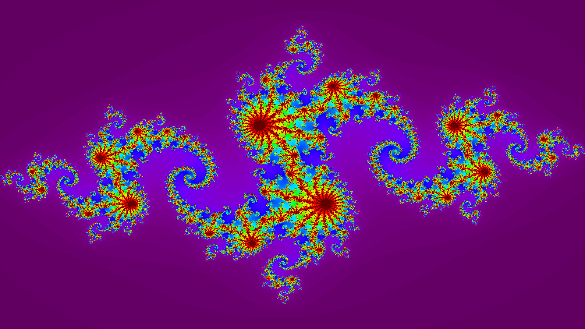

# Fractal in Rust

[](/LICENSE)
[](https://github.com/EmperorYP7/rust-fractal/stargazers)

This project outputs a fractal as an image in `output.png`. The source code of this project
was taken from [here](https://rust-lang-nursery.github.io/rust-cookbook/concurrency/threads.html#draw-fractal-dispatching-work-to-a-thread-pool).

This is my first project in Rust, so I looked upon various resources to make this project.



## How to run this?

1. Clone this repo on your local machine

1. Go to the project's root directory and open a terminal

1. Issue commands:
```bash
    cargo build
    cargo run
```

4. You'll have an output image at `./output.png`
